[TOC]

## Basic Statistical Analysis
### 개요

#### 분석환경
- 분석 플랫폼 : 구글 코랩(Google Colaboratory)
- 사용 언어 : 파이썬(Python)
- 사용 패키지 : pandas, seaborn, matplotlib, scipy.stats

#### 연구 목적
- 40대 ~ 60대 성인 대상으로 기본 신체 정보와 성인병(고혈압, 혈당이상 등) 간의 **연관성**을 파악한다.
#### 가설 설정
- 가설 1 : 검진자의 비만정도, 음주여부, 흡연여부에 따라 고혈압, 고혈당, 혈색소이상, 요단백여부에 영향을 끼친다.
#### 사용 데이터
- 국민건강보험공단\_건강검진정보
- 출저 : 공공데이터포털(국민건강보험공단 제공)
- url : https://www.data.go.kr/data/15007122/fileData.do

##### 데이터 항목
| 데이터이름      | 데이터설명                             | 데이터타입 | 비고  |
| --------------- | -------------------------------------- | ---------- | ----- |
| 성별코드        | 성별에 따른 숫자 부여                  | 범주형     | 1,2   |
| 연령대코드      | 연령대에 따른 숫자 부여                | 범주형     | int   |
| 신장(5cm단위)   | 내림한 신장의 5cm단위로 할당           | 범주형     | cm    |
| 체중(5kg단위)   | 내림한 체중의 5kg단위로 할당           | 범주형     | kg    |
| 허리둘레        | 검진자의 허리둘레                      | 연속형     | cm    |
| 수축기 혈압     | 혈압 검사시 검진자의 최고 혈압         | 연속형     | mmHg  |
| 이완기 혈압     | 혈압 검사시 검진자의 최저 혈압         | 연속형     | mmHg  |
| 식전 혈당       | 검진자의 식사 전 혈당 수치             | 연속형     | ㎎/㎗ |
| 총 콜레스테롤   | 혈청 중 콜레스테롤의 총 합             | 연속형     | int   |
| 혈색소          | 혈액 및 혈구 속에 존재하는 색소 단백질 | 범주형     | int   |
| 요단백          | 소변에 포함된 단백질 정도              | 범주형     | int   |
| 혈청크레아틴    | 근육의 발육과 운동에 관계된 체내요소   | 연속형     | IU/L  |
| (혈청지오티)AST | 장기 내 효소, 장기 손상시 농도 증가    | 연속형     | IU/L  |
| (혈청지오티)ALT | 장기 내 효소, 장기 손상시 농도 증가    | 연속형     | IU/L  |
| 감마지티피      | 혈중 효소, 간기능 장애시 증가          | 연속형     | IU/L  |
| 흡연상태        | 검진자의 흡연 여부                     | 범주형     | 1, 2  |
| 음주여부        | 검진자의 음주 여부                     | 범주형     | 1, 2  |

- 이상 본 연구에서 사용한 데이터 항목이다.
- 이외로 30%이상의 결측치가 관측된 데이터와 연구에 필요하지 않는 데이터는 제외하고 연구를 진행하였다

---

### 데이터전처리
#### 데이터 명시화
- 데이터 항목에 대한 가독성을 위해 성별코드, 흡연상태 데이터를 명시화하였다.
	- 성별코드 : 남성, 여성을 뜻하는 1, 2 의 데이터를 각 "M", "W"로 변환하였다.
	- 흡연상태 : 흡연, 흡연하지않음을 뜻하는 1, 2 의 데이터를 각 "N", "Y"로 변환하였다.
#### 결측치 처리
- "음주여부" 데이터에서 30%이상의 결측치를 확인하였다.
- "음주하지 않음"을 뜻하는 데이터가 0 아니면 공백으로 할당되었다.
- "음주하지않음", "음주함"의 데이터를 명시적으로 "N", "Y"로 변환하였다.

#### 이상치 처리(삭제)

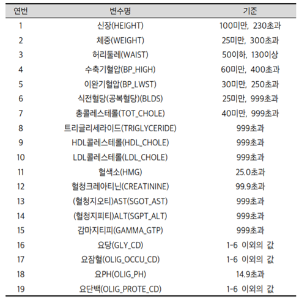
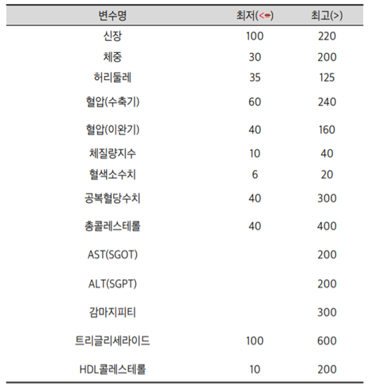

- 위 기준에 따라 이상치를 처리(삭제)하도록 한다.

#### 연령대 데이터 분류
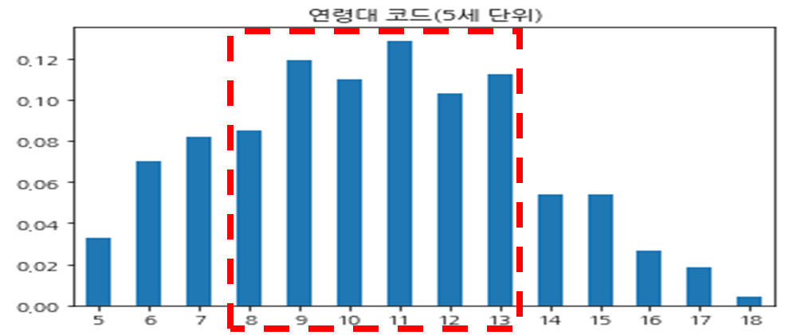

- 40 ~ 60 세 연령대에 해당하는 8 ~ 13의 값을 갖는 데이터만 사용한다.

#### 파생변수 생성
- BMI 지수 = 체중(kg)/(신장(m)^2)
  - 가설 검정에 사용될 BMI 지수 데이터를 추가한다.

| 항목           | 검진결과 수치에 대한 질병판단기준                            |
| -------------- | ------------------------------------------------------------ |
| 비만           | BMI 지수 25kg/m^2 이상시 비만 진단                           |
|                | 허리둘레수치 성인남자 90cm이상, 성인여자 85cm이상시 비만 진단 |
| 혈압           | i) 정상범위 수축기혈압 120~139mmHg 미만, 이완기혈압 80~89mmHg 미만.  이상시 **고혈압**진단(뇌졸증, 협심증, 심근경색 원인) |
|                | ii) 정상범위 수축기혈압 90mmHg 이하, 이완기혈압 60mmHg 미만일 경우 **저혈압** 판단. |
| 혈색소         | •정상범위 남성 13 ~ 17g/dL, 여성 12~16g/dL 이상시 **신장질환** 의심 |
| 혈액크레아티닌 | •정상범위 0.50 ~ 1.4mg/dL, 이상시 **신장질환** 의심.         |
| 요단백         | •정상범위 수치 3 이하, 고혈압, 당뇨환자에게 보임, 이상시 **신장질환** 의심 |
| ALT            | •정상범위 0~40U/L. 100U/L이하의 증가는 **간질환** 의심, 100~500U/L 증가는   **간****,** **심장****,** **근육 관련질환** 의심, 500U/L 이상의 증가는 **급성 간****,****심장 질환** 발생 의심. |
| AST            | •정삼범위 0~40U/L. 이상시 간, 심장, 근육 등의 **장기손상** 의심. |
| 감마지티피     | 정상범위 남성 11~63 U/L, 여성 8~35 U/L 이상시 간을 비롯한 **장기손상** 의심.  ⑵ |

- 위 기준에 따른 **고혈압여부, 비만여부, 당뇨여부, 혈색소이상, 혈청크레아티닌이상, 요단백이상** 컬럼 생성

---

### 가설검정
- 집단에 따른 카이제곱검정 시행

- 가설 1: 검진자의 비만정도, 음주여부, 흡연여부에 따라 고혈압, 고혈당, 혈색소이상, 요단백여부에 영향을 끼친다.
	
#### 분할표 및 시각화 비교
- 성별, 원인(비만, 음주, 흡연)여부와 질병(고혈압, 당뇨, 혈색소이상, 요단백이상)에 대한 분할표 제시.
- 분할표를 시각화하여 성별, 원인, 질병의 연관성을 확인.

1. 성별, 비만 여부 - 질병 여부 분할표

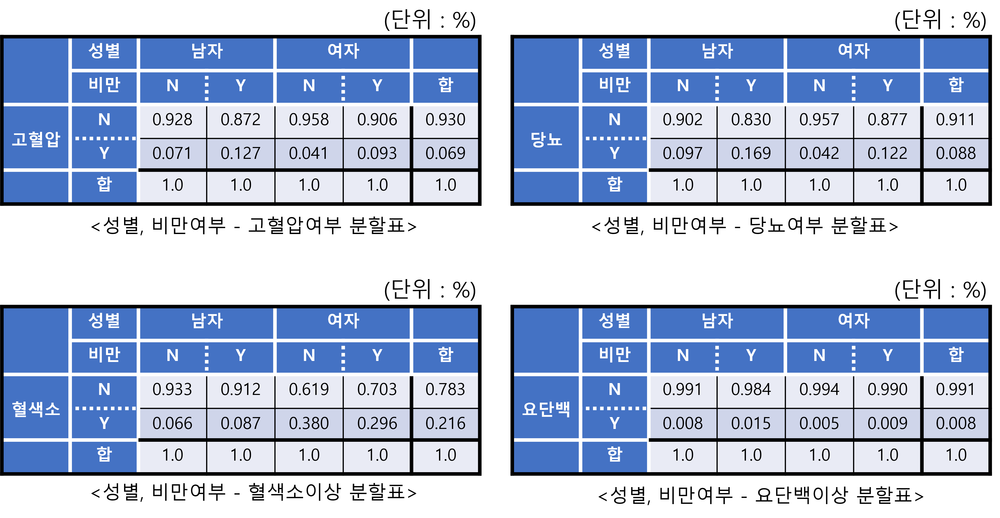

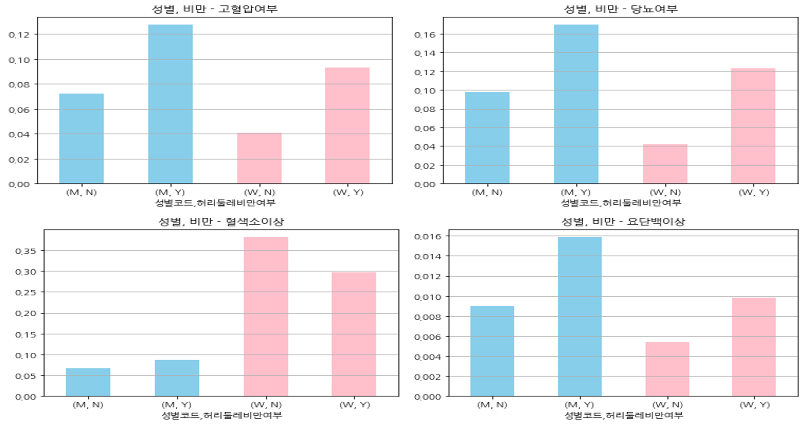

2. 성별, 흡연 여부 - 질병 여부 분할표

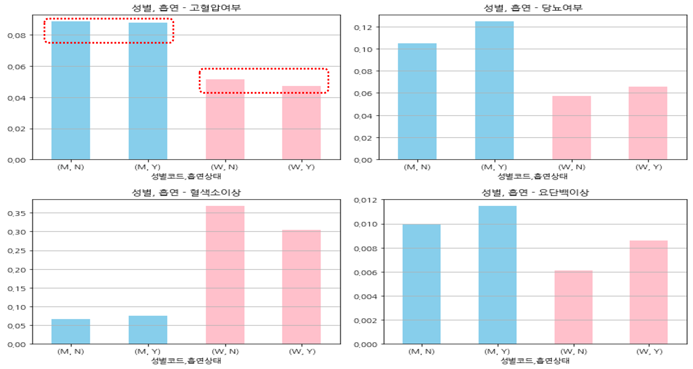

3. 성별, 음주 여부 - 질병 여부 분할표

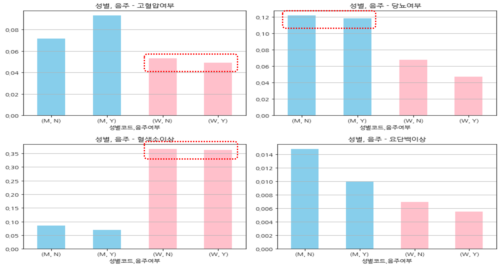

#### 분할표 결론

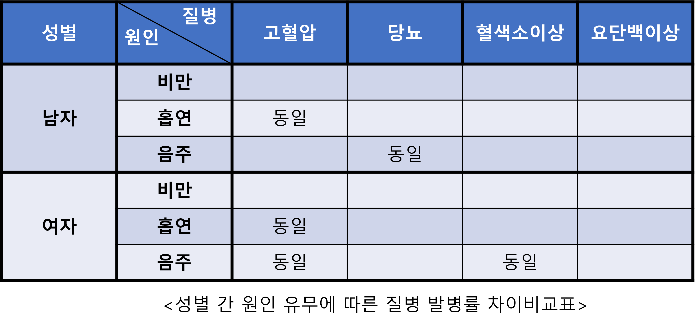

- 시각화된 그래프를 참고하면,
  남자 집단에서 **흡연–고혈압, 음주–당뇨**
  여자 집단에서 **흡연–고혈압, 음주–당뇨, 음주–혈색소이상** 의 변수 조합에서, 원인에 유무에 상관없이 질병의 발병률이 같음을 알 수 있다.

#### 코크란 멘텔 헨젤 검정 시행.
##### Cochran-Mantel-Haenszel(CMH) 검정
- 성별 , 원인 , 질병 변수로 구성된 분할표에서 **성별에 구분하였을때**, 원인 – 질병에 영향이 끼치는지에 대한 **조건부독립성** 검정

##### CMH 검정 결과

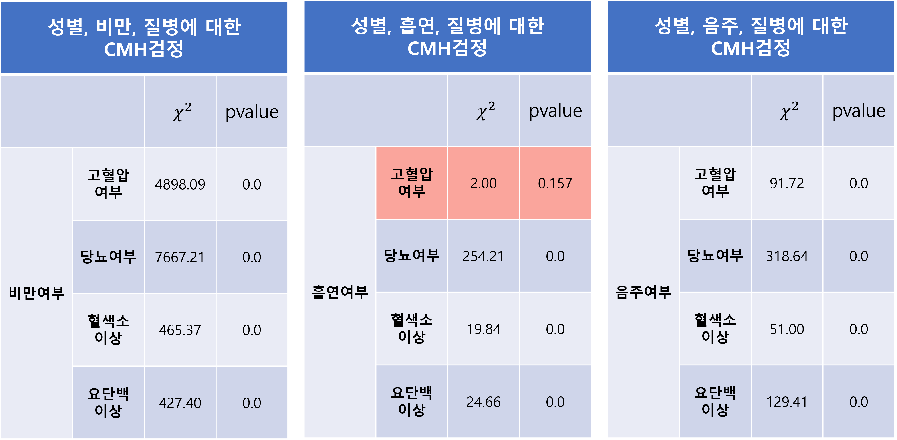

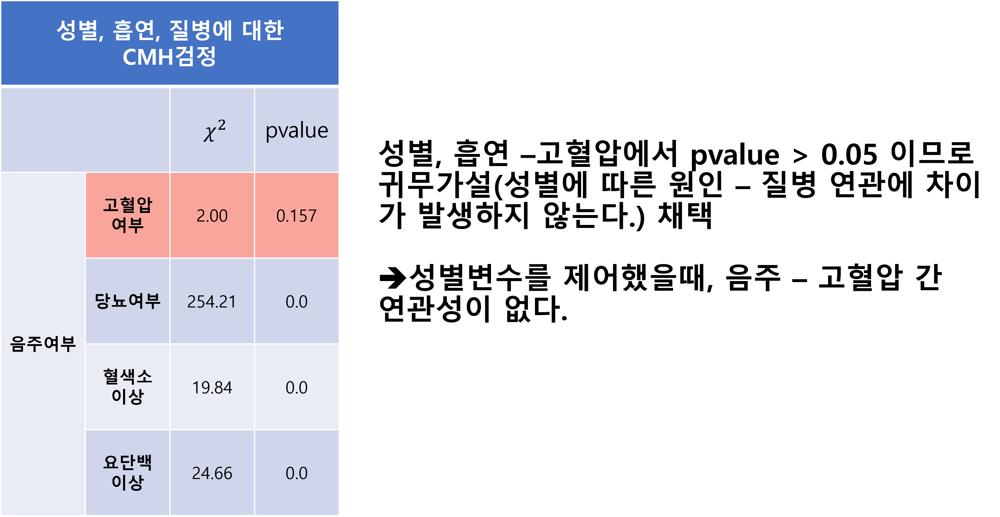

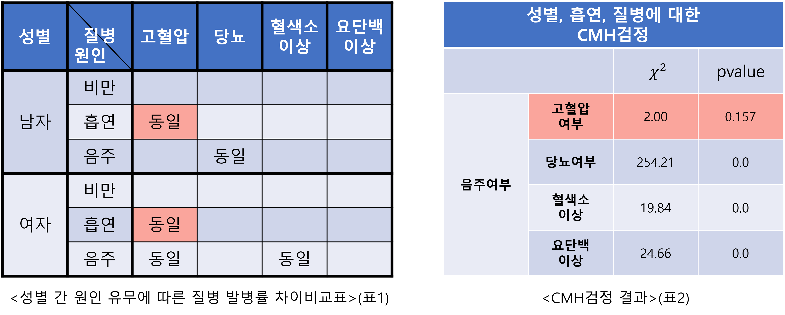

- 시각화 상에서 남성, 여성 집단에서 흡연 유무에 따란 고혈압의 발병률이 동일하다.(표1)
- CMH검정 결과(표2)에서 음주여부와 고혈압여부간에 연관성이 없음을 확인하였다.

### 가설검정 결과

1. 시각화상에서 성별, 원인 – 질병 간 연관성이 없는 항목을 확인
2. CMH 검정을 통하여 성별집단을 구분하였을때, 원인 – 질병 간 연관 확인

- 위 1. 2. 의 결과로 남성, 여성 집단에서 **음주여부**와 **고혈압**의 **발병률**간의 연관성은 없음을 알 수 있다.
- 나머지 원인 - 질병 조합은 연관성이 존재한다.

---

### 참고문헌

1. 임현선 외 7. 국민건강정보DB 활용 빅데이터 연구의 질 향상을 위한 분석방법 점검도구 개발 연구 - 국민건강정보DB 활용 문헌들의 방법론 고찰. 국민건강보험 일산병원 연구소 (2021)
2. 서울아산병원 검사/시술/수술 정보. 서울아산병원 http://m.amc.seoul.kr/asan/mobile/healthinfo/management/managementMobileSubMain.do
3. 한국비만학회 비만상식 비만의진단과평가. 한국비만학회
    [http://general.kosso.or.kr/html/?pmode=obesityDiagnosis ](http://general.kosso.or.kr/html/?pmode=obesityDiagnosis): 
4. Alan Agresti. 범주형 자료분석 개론(제3판) - 자유아카데미
4. 이용희. 의학통계학(2021) – 서울시립대학교 통계학과
